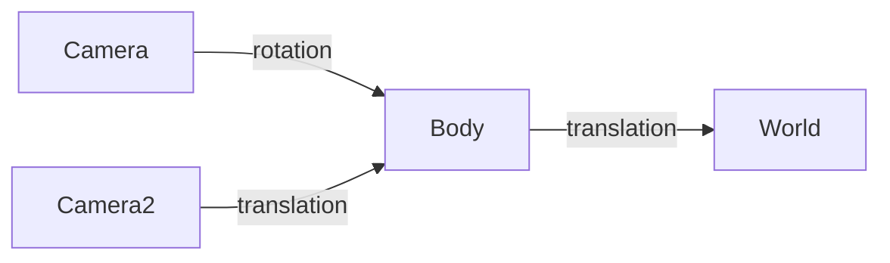

# spatia

spatia is a header-only C++23 geometry library that keeps coordinate systems in the type system.

**Coordinate systems and primitive types**
```cpp
#include <spatia/spatia.hpp>
using namespace spatia;

struct Body  { static constexpr std::size_t dimension = 3; };
struct World { static constexpr std::size_t dimension = 3; };

Point<Body> p_in_body{1.5, 2.5, 3}; // Each primitive type is attached to a coordinate system
Vector<Body> v_in_body = p_in_body - Point<Body>{1, 2, 3}; // Subtracting points in the same system yields a vector in that system
// p_in_body - Point<World>{10, 20, 30};  // Subtracting points in different systems is a compile-time error
```

**Transformation and inverse**
```cpp
// Body and World have aligned axes, but different origins.
Point<World> body_origin_in_world{10.0, 20.0, 30.0};
Translation<Body, World> body_to_world = Translation<Body, World>{body_origin_in_world};

Point<World> p_in_world = body_to_world(Point<Body> {1.5, 2.5, 3});
// Translation leaves vector components unchanged.
Vector<World> v_in_world = body_to_world(Vector<Body> {0.5, 0.5, 0});

Point<Body> p_back_in_body = body_to_world.inverse()(p_in_world);
```

**Composing transformations**
```cpp
// Introduce "Camera" which is rotated relative to Body, but shares the same origin
struct Camera  { static constexpr std::size_t dimension = 3; };
EulerZYX<Camera, Body> camera_in_body{/*yaw*/degrees(30), /*pitch*/degrees(5), /*roll*/degrees(0)};
Rotation<Camera, Body> camera_to_body = to_rotation(camera_in_body);

// The right operand runs first; intermediate coordinate systems must match (camera->body->world).
// The product type is deduced as Rigid<Camera, World> (rotation + translation).
Rigid<Camera, World> camera_to_world = body_to_world * camera_to_body;

Point<World> p_in_world2 = camera_to_world(Point<Camera>{0, 0, 5});
```

**Transform graph**
Use `combine(...)` to build a transform graph and convert between connected coordinate systems without composing each path
manually.



```cpp
struct Camera2  { static constexpr std::size_t dimension = 3; };
auto body_to_camera2 = Translation<Body, Camera2>{Point<Camera2>{1.0, 2.0, 1.5}};


auto transforms =  combine(
    to_bidirectional(body_to_world), // to_bidirectional adds world->body
    to_bidirectional(camera_to_body),
    to_bidirectional(body_to_camera2));

Point<Camera2> p_in_camera2{1.0, 2.0, 3.0};
// A shortest path is chosen at compile time; a missing path is a compile-time error.
Point<Camera> p_in_camera = transforms.to<Point<Camera>>(p_in_camera2);
Point<World> p_in_world3 = transforms.to<Point<World>>(p_in_camera2);
Point<Body> p_in_body3 = transforms.to<Point<Body>>(p_in_camera2);
```

## Start here

[Step-by-step guide](docs/guide.md) · [Complete example](examples/guide)

## Build and test

```sh
# CMake target: spatia::spatia. Tests default to ON; documentation defaults to OFF.
# Use -S examples/guide for the standalone example.
cmake -S . -B build
cmake --build build
ctest --test-dir build
```